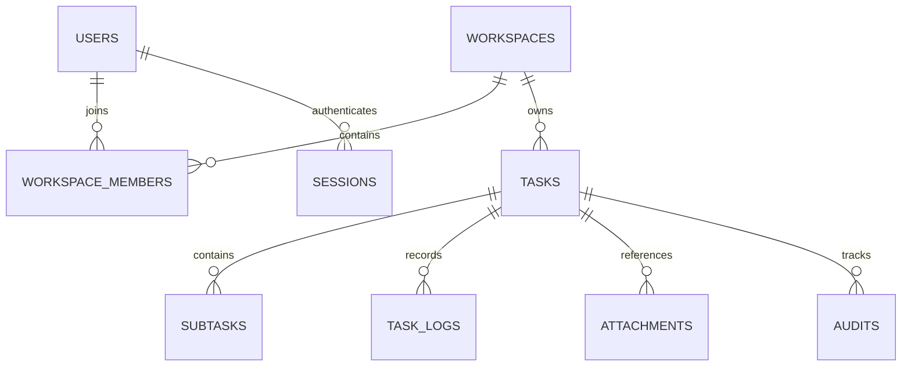

# AI Task Tracker Basic Server

## Architecture

The server is an ASP.NET Core 7 REST API. It can run with SQLite for local
development or Supabase Postgres for shared/team data. It is intentionally
simple to deploy for a small team while keeping API contracts suitable for the
Windows desktop app and an Android APK.



Core rules:

- A user can belong to multiple workspaces.
- Every task belongs to exactly one workspace.
- Membership role is `owner` or `member`.
- A new account creates its first workspace automatically.
- A user joins another workspace with its invite code.
- Task deletion is soft deletion.
- Every task mutation writes an audit row.
- Passwords use PBKDF2-SHA256 with a unique salt.
- Bearer session tokens expire after 30 days; only their SHA-256 hashes are
  stored in the database.

## Run Locally

Local development uses SQLite by default:

```powershell
dotnet run --project AiTaskTracker.Server.csproj
```

Default URL:

```text
http://127.0.0.1:5187
```

Database file:

```text
App_Data\aitasktracker.db
```

The database and tables are created by EF Core migrations on first start.

If `dotnet run` is blocked by local NuGet/user-profile permissions, build once
and run the compiled DLL directly:

```powershell
dotnet build AiTaskTracker.Server.csproj -c Release
dotnet .\bin\Release\net7.0\AiTaskTracker.Server.dll --urls http://127.0.0.1:5187
```

If you previously ran an older server build that used `EnsureCreated`, reset the
local development database once so EF can create its migration history table:

```powershell
.\scripts\Reset-ServerDatabase.ps1 -Force
```

Run a smoke test after the server is started:

```powershell
.\scripts\Test-ServerApi.ps1
```

The smoke test creates a throwaway account, workspace, task, log, subtask,
attachment reference, focus query, and audit query.

## Supabase Postgres Setup

Supabase should be used as the Postgres database host. The ASP.NET API itself
still needs a .NET-capable host such as Render, Fly.io, Azure App Service,
Railway, or a VPS. Supabase Edge Functions are Deno/TypeScript, so deploying
this C# API directly inside Supabase is not the intended path.

Recommended first setup:

1. Create a Supabase project.
2. Open Supabase Dashboard -> Connect.
3. Copy the Session Pooler connection string if your API host is IPv4-only.
4. Set these environment variables on the API host:

```powershell
$env:Database__Provider = "Postgres"
$env:ConnectionStrings__Default = "Host=aws-REGION.pooler.supabase.com;Port=5432;Database=postgres;Username=postgres.PROJECT_REF;Password=YOUR_PASSWORD;SSL Mode=Require;Trust Server Certificate=true"
```

For a persistent backend on an IPv6-capable host, Supabase's direct connection
is also valid:

```text
Host=db.PROJECT_REF.supabase.co;Port=5432;Database=postgres;Username=postgres;Password=YOUR_PASSWORD;SSL Mode=Require;Trust Server Certificate=true
```

There is also a copyable example file:

```text
appsettings.Supabase.example.json
```

Do not commit a real Supabase password into `appsettings.json`.

When the API starts with `Database__Provider=Postgres`, EF Core applies bundled
migrations to Supabase on startup. For the basic server phase this is the
simplest deploy path. Later, production can split migration execution into a
separate release step if needed.

## Simple Deploy Path: Render API + Supabase DB

This repo includes a Render Blueprint:

```text
render.yaml
```

Minimal flow:

1. Push this repo to GitHub.
2. In Render, create a new Blueprint from the repo.
3. Render reads `render.yaml` and creates `ai-task-tracker-api`.
4. Add the secret env var `ConnectionStrings__Default` from Supabase Dashboard -> Connect.
5. Deploy.
6. Open `https://YOUR_RENDER_SERVICE.onrender.com/health`.

Use a fresh Supabase project/database for the first deploy, or an empty schema.
The API will create tables such as `users`, `workspaces`, `tasks`, `audits`,
and EF's `__EFMigrationsHistory`.

The non-secret env names are listed in:

```text
.env.server.example
```

Render runs:

```bash
dotnet publish AiTaskTracker.Server.csproj -c Release -o out
dotnet out/AiTaskTracker.Server.dll --urls http://0.0.0.0:$PORT
```

## Connect an APK on the Same Wi-Fi

Run the server on all network interfaces:

```powershell
dotnet run --project AiTaskTracker.Server.csproj --urls http://0.0.0.0:5187
```

The APK uses the PC's LAN address, for example:

```text
http://192.168.1.20:5187
```

Windows Firewall must allow inbound TCP traffic on port `5187`. Plain HTTP is
only suitable for local development. A remotely hosted server should use HTTPS
behind a reverse proxy.

## Authentication Flow

Register and create the first workspace:

```http
POST /api/auth/register
```

```json
{
  "email": "owner@example.com",
  "password": "a-strong-password",
  "display_name": "Owner",
  "workspace_name": "Product Team"
}
```

The response contains `access_token`, `user`, and `workspaces`. Desktop and APK
send the token on later requests:

```http
Authorization: Bearer <access_token>
```

Another user joins the team:

```http
POST /api/workspaces/join
```

```json
{
  "invite_code": "TEAM_INVITE_CODE"
}
```

## API

Anonymous:

- `GET /health`
- `POST /api/auth/register`
- `POST /api/auth/login`

Authenticated workspace operations:

- `GET /api/workspaces`
- `POST /api/workspaces`
- `POST /api/workspaces/join`

Authenticated task operations:

- `GET /api/workspaces/{workspaceId}/tasks`
- `GET /api/workspaces/{workspaceId}/tasks/{id}`
- `POST /api/workspaces/{workspaceId}/tasks`
- `PATCH /api/workspaces/{workspaceId}/tasks/{id}`
- `DELETE /api/workspaces/{workspaceId}/tasks/{id}`
- `POST /api/workspaces/{workspaceId}/tasks/{id}/logs`
- `POST /api/workspaces/{workspaceId}/tasks/{id}/subtasks`
- `PATCH /api/workspaces/{workspaceId}/tasks/{id}/subtasks/{subtaskId}`
- `POST /api/workspaces/{workspaceId}/tasks/{id}/attachments`
- `GET /api/workspaces/{workspaceId}/tasks/{id}/audits`
- `GET /api/workspaces/{workspaceId}/focus/today`

JSON uses `snake_case`. AI-originated writes can include actor metadata:

```json
{
  "actor": {
    "actor_name": "Codex",
    "actor_type": "ai",
    "source": "mcp"
  }
}
```

Attachment V1 stores references only:

```json
{
  "type": "url",
  "title": "Spec",
  "target": "https://example.com/spec",
  "note": "No file upload in V1"
}
```

Use `"type": "file"` for a local file path reference. The server stores the
path string; it does not copy or upload the file.

## Minimal Setup Checklist

1. Install .NET 7 SDK.
2. Run `dotnet build AiTaskTracker.Server.csproj`.
3. Start the API with `dotnet run --project AiTaskTracker.Server.csproj`.
4. In another terminal run `.\scripts\Test-ServerApi.ps1`.
5. For APK testing on the same Wi-Fi, run with `--urls http://0.0.0.0:5187` and use the PC LAN IP.

## Current Boundary

The WPF desktop app still reads and writes its local JSON snapshot. The server
is now ready as a separate shared data source, but desktop synchronization has
not been connected yet.

For this first phase SQLite is appropriate for a small team and one server
process. When concurrent usage or hosting grows, the EF Core data layer can be
moved to PostgreSQL while preserving the REST contracts.
